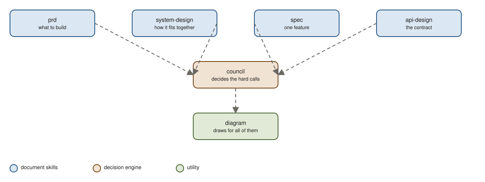

# agent-skills

Skills for Claude Code that help you think before you build: decide hard calls with a panel, write the documents your team expects, and draw the pictures that explain them. Each skill installs on its own and works alone.



## The skills

| Skill | One line | Start here |
|---|---|---|
| **council** | Five AI advisers debate your decision, score each other blind, a chairman gives one verdict, a week plan, and a decision record | [README](skills/council/README.md) |
| **spec** | Technical spec for one feature, hard calls sent to council | [README](skills/spec/README.md) |
| **system-design** | Architecture document: components, flow, capacity, failure modes | [README](skills/system-design/README.md) |
| **api-design** | API or SDK contract: resources, schemas, errors, versioning | [README](skills/api-design/README.md) |
| **prd** | Product requirements: problem, users, goals with numbers, scope, launch | [README](skills/prd/README.md) |
| **diagram** | Excalidraw diagrams from a short spec, clean layout, consistent colours | [README](skills/diagram/README.md) |

The document skills call council for decisions that are genuinely contested and cite the record it writes. Every document, plan, and record has a Feedback section: write in it, run the skill again, the file updates in place. Stop when you are happy.

## Install

```bash
claude plugin marketplace add jhesg/agent-skills
claude plugin install council@jhesg-agent-skills
claude plugin install spec@jhesg-agent-skills        # repeat for the others you want
```

Restart your Claude Code session after installing.

## First run

```
/council I'm torn between leading our 9-month services migration and shipping the billing engine sales says blocks 3 deals. Same comp, never led a platform project. Should I take the migration?
```

A transcript opens in your browser while the panel works. You get a verdict, a plan for the week, and a decision record you can share.

## For contributors

Skills live in `skills/`, one folder each, self-contained. Their browser artifacts are built from shared React packages in `packages/` and `artifacts/`, then committed into the skill as a single HTML file, so users never need a build step.

```bash
pnpm install
pnpm check          # validate skills, typecheck, build artifacts, confirm nothing drifted
pnpm new-skill foo  # scaffold a skill and its artifact
```

More: [architecture](docs/ARCHITECTURE.md), [skill guidelines](docs/SKILL_GUIDELINES.md), [artifact guidelines](docs/ARTIFACT_GUIDELINES.md), [design system](docs/DESIGN_SYSTEM.md), [roadmap](docs/ROADMAP.md), and [AGENTS.md](AGENTS.md) for the rules agents follow in this repo.
