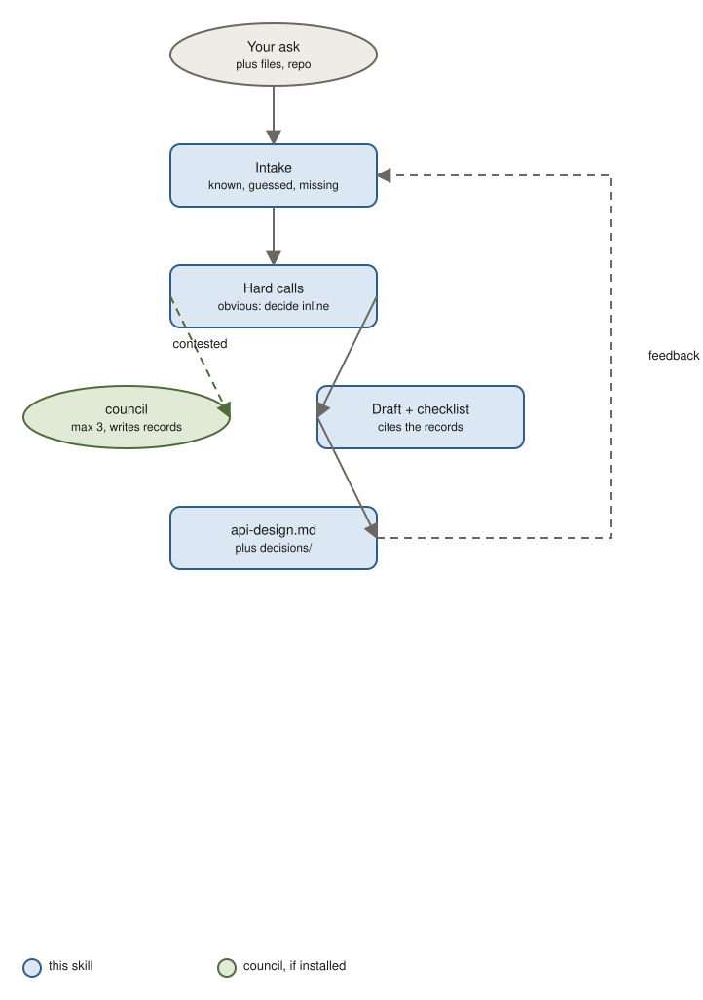

# api-design

Design an API or SDK surface: resources, operations, schemas with examples, errors, pagination, versioning, auth. Contested contract decisions go to a panel and come back as decision records.

## Use it when

- You are exposing an API to partners or another team and want the contract agreed before code.
- You are adding webhooks or an SDK and need conventions pinned down.
- An existing API needs a breaking change and a deprecation path.

Not for the internals behind the API (use spec or system-design) or for product requirements (prd).

## How it works



1. Intake: the skill reads your message, files, and repo, fills the template, and marks what it knows, what it guessed, and what is missing. It asks at most three questions.
2. It finds the hard calls. Obvious ones are decided inline with a one-line reason. Genuinely contested ones, at most three, go to the [council](https://github.com/jhesg/agent-skills/tree/main/skills/council) skill, which writes a decision record next to your document.
3. It drafts the document, cites the records instead of re-arguing them, and runs a review checklist.
4. You get `api-design.md` plus a `decisions/` folder. Write in the Feedback section, run it again, it updates in place. As many rounds as you want.

## What is in the document

Purpose and consumers, principles, resources, operations table, schemas with examples, error catalog, pagination, versioning and deprecation, auth and limits, SDK ergonomics, worked examples, compatibility, alternatives, open questions, decision records, changelog.

## Try it

```
Design the public REST API for job postings: list, search, get, create, update, close, plus webhooks for application events. Our internal API is camelCase JSON with cursor pagination.
```

You get: an operations table, request and response examples, an error catalog, a versioning policy, and decision records for calls like webhook delivery guarantees.

```
/api-design docs/api/jobs.md — feedback: partners want bulk create, and API keys must be per integration, not per user.
```

You get: the file updated with bulk semantics and the auth model, plus a changelog line.

## Install

```bash
claude plugin marketplace add jhesg/agent-skills
claude plugin install api-design@jhesg-agent-skills
claude plugin install council@jhesg-agent-skills   # optional, for contested decisions
```

Internals for agents: [SKILL.md](SKILL.md). Template: [references/template.md](references/template.md).
