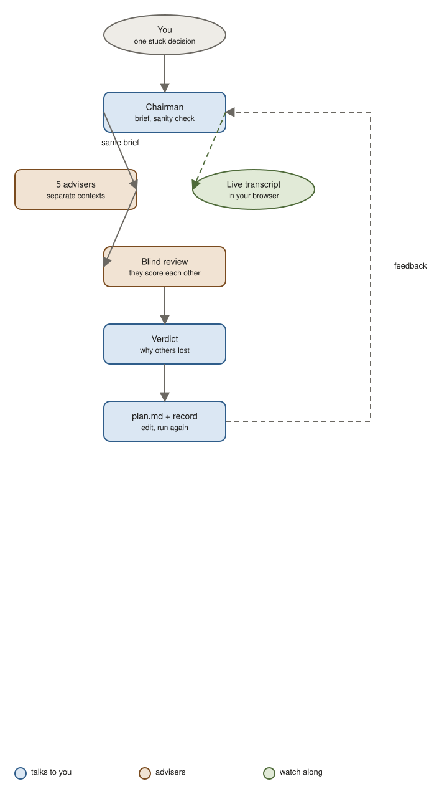

# council

Five AI advisers argue a decision from different angles, score each other blind, and a chairman gives you one verdict, a week plan, and a decision record you can hand to your team.

## Use it when

- You are torn between two or more real options and the consequences last weeks.
- You need an ADR or decision record, even for a small choice, so the reasoning survives.
- You have a problem but no options yet and want them proposed before they are debated.

Not for factual questions, or for choices you can undo in an afternoon. The skill will say so and answer directly instead.

## How it works



1. The chairman turns your message into a brief and checks the decision is worth a panel.
2. Five advisers, each in its own context, answer the same brief: contrarian, first-principles, expansionist, assumption auditor, executor.
3. They score each other's answers without knowing who wrote what.
4. The chairman decides, names why the other options lost, and sets a kill criterion.
5. You get `plan.md` for this week and `decision-record.md` for history. Edit the feedback section, run it again, the record updates in place.

A live transcript opens in your browser while it runs, so you can watch the exchange.

## Try it

```
/council I'm a staff engineer. My CTO wants me to lead a 9-month monolith-to-services migration; alternatively I ship the billing engine that sales says blocks 3 enterprise deals. Same comp. Never led a platform project. Should I take the migration?
```

You get: a frozen brief, five short takes, a verdict with the deciding point and biggest risk, a Monday-to-Friday plan, and a decision record.

```
/council should I use pg-boss or BullMQ for a side project queue? I need an ADR for the team with why we rejected the others and what else we considered.
```

You get: the same flow, plus the panel proposes alternatives outside your two, and the record lists each rejected option with a reason.

## Install

```bash
claude plugin marketplace add jhesg/agent-skills
claude plugin install council@jhesg-agent-skills
```

Internals for agents: [SKILL.md](SKILL.md).
