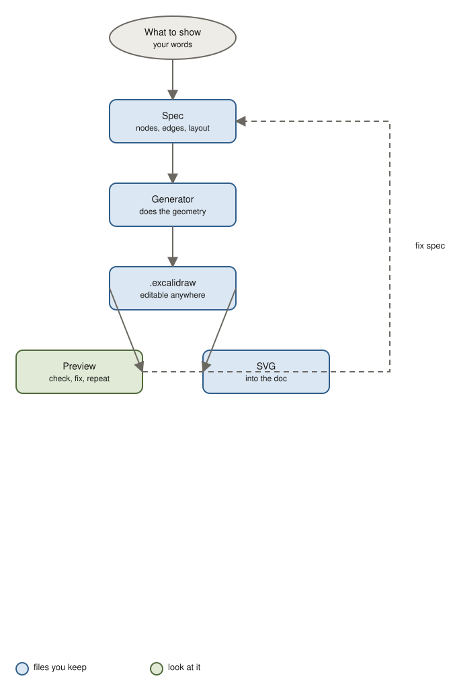

# diagram

Turn "show me how X connects" into an Excalidraw diagram with clean layout and consistent colours, preview it, and drop an SVG into your doc. The `.excalidraw` file stays editable in Excalidraw.

## Use it when

- Three or more components relate in a way a sentence cannot hold.
- A flow branches, retries, or fails.
- You want two or three options compared side by side, at the same level of detail.

Not for lists or two-step flows. The skill will suggest a table or a sentence instead.

## How it works



1. You say what the picture should show. The skill writes a small spec: nodes, edges, layout.
2. A script does the geometry. No overlapping boxes, arrows land where they should.
3. You preview it in the browser, fix the spec if the story reads wrong.
4. The SVG goes into the document; the `.excalidraw` sits next to it for hand edits.

Colours mean the same thing in every diagram: blue chosen, brown alternative, green external, red failure.

## Try it

```
Draw the notification pipeline: API writes an outbox row, a worker polls it and sends to SendGrid and APNs, failures go to a dead-letter table after 5 retries.
```

You get: a left-to-right flow, dashed red failure path, legend, SVG and `.excalidraw`.

```
Compare our three queue options side by side: outbox + worker, Vercel Queues, stay synchronous with circuit breakers. Mark which one we chose.
```

You get: three columns, one per option, same number of boxes each, chosen option in blue.

## Install

```bash
claude plugin marketplace add jhesg/agent-skills
claude plugin install diagram@jhesg-agent-skills
```

Internals for agents: [SKILL.md](SKILL.md). Spec format: [references/spec-format.md](references/spec-format.md).
