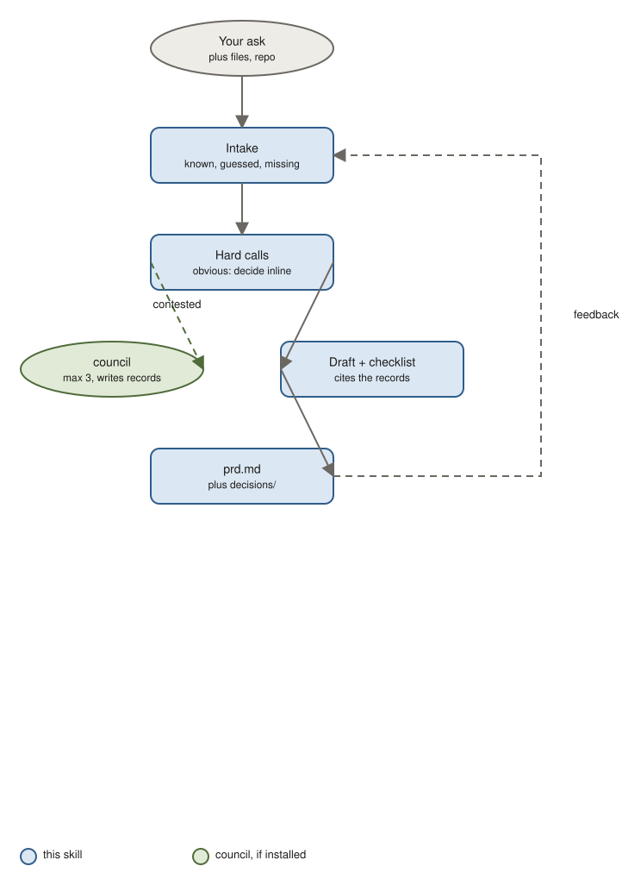

# prd

Write a product requirements document: the problem with evidence, who it is for, goals with numbers, scope, stories, requirements, launch plan. Contested product calls go to a panel and come back as decision records.

## Use it when

- You need product agreement before design starts.
- A feature idea keeps coming back and nobody has written down why, for whom, and how you would know it worked.
- Scope is being argued and you want the must/should/won't settled.

Not for how to build it (use spec, system-design, or api-design).

## How it works



1. Intake: the skill reads your message, files, and repo, fills the template, and marks what it knows, what it guessed, and what is missing. It asks at most three questions.
2. It finds the hard calls. Obvious ones are decided inline with a one-line reason. Genuinely contested ones, at most three, go to the [council](https://github.com/jhesg/agent-skills/tree/main/skills/council) skill, which writes a decision record next to your document.
3. It drafts the document, cites the records instead of re-arguing them, and runs a review checklist.
4. You get `prd.md` plus a `decisions/` folder. Write in the Feedback section, run it again, it updates in place. As many rounds as you want.

## What is in the document

Problem statement, evidence, users and jobs, goals and metrics table, non-goals, scope, stories and flows, requirements, UX notes, dependencies and risks, launch and measurement, alternatives, open questions, decision records, changelog.

## Try it

```
PRD for a candidate availability feature: candidates mark themselves open to work with a start date and preferences, recruiters filter by it. 40k MAU, recruiters complain profiles are stale.
```

You get: a PRD with a primary metric, baseline and target, must/should/won't scope, and a decision record if the target segment or metric was contested.

```
/prd docs/product/availability.md — feedback: legal says availability is sensitive in some markets, sales wants it gated to paid recruiters.
```

You get: the document updated with the constraint and the gating decision, re-run through council if it was recorded.

## Install

```bash
claude plugin marketplace add jhesg/agent-skills
claude plugin install prd@jhesg-agent-skills
claude plugin install council@jhesg-agent-skills   # optional, for contested decisions
```

Internals for agents: [SKILL.md](SKILL.md). Template: [references/template.md](references/template.md).
