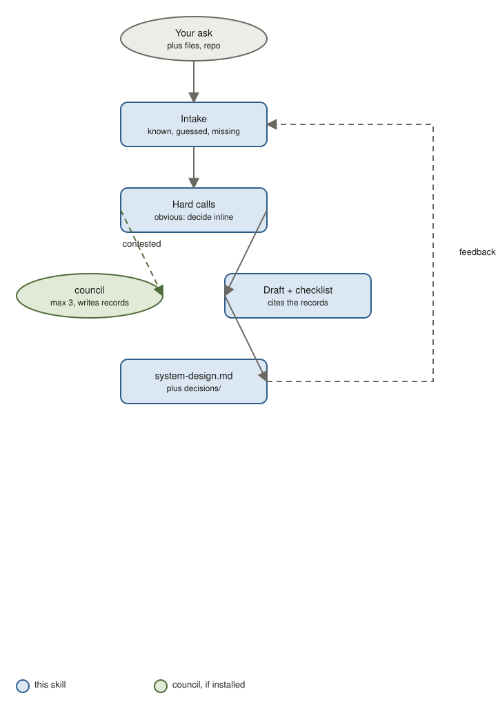

# system-design

Write a system design document: components, data flow, storage, capacity, failure modes, operations, cost. Contested architecture choices go to a panel and come back as decision records.

## Use it when

- You are designing or redesigning a subsystem and need the team aligned before building.
- Something has to scale, and you want the capacity math and failure modes written down.
- You need an architecture review artefact.

Not for one feature inside an existing design (use spec) or an API contract (api-design).

## How it works



1. Intake: the skill reads your message, files, and repo, fills the template, and marks what it knows, what it guessed, and what is missing. It asks at most three questions.
2. It finds the hard calls. Obvious ones are decided inline with a one-line reason. Genuinely contested ones, at most three, go to the [council](https://github.com/jhesg/agent-skills/tree/main/skills/council) skill, which writes a decision record next to your document.
3. It drafts the document, cites the records instead of re-arguing them, and runs a review checklist.
4. You get `system-design.md` plus a `decisions/` folder. Write in the Feedback section, run it again, it updates in place. As many rounds as you want.

## What is in the document

Context and scope, requirements with numbers, constraints, architecture with a diagram, data flow, storage and consistency, capacity table, failure-mode table, security, operations, migration, alternatives, open questions, decision records, changelog.

## Try it

```
System design for our notification pipeline redesign: email, in-app, push currently synchronous in API handlers, p95 climbing, duplicate sends on retries, need exactly-once for application emails. Vercel + Fly.io + Neon, 4 backend engineers, +$600/month cap.
```

You get: a design with one architecture diagram, capacity and failure tables, and decision records for the contested calls, probably sync-vs-async and queue choice.

```
/system-design docs/architecture/notifications.md — feedback: SRE rejects beta infrastructure, drop Vercel Queues and re-evaluate.
```

You get: the document updated, the queue decision re-run through council with SRE's constraint, and the citing section rewritten.

## Install

```bash
claude plugin marketplace add jhesg/agent-skills
claude plugin install system-design@jhesg-agent-skills
claude plugin install council@jhesg-agent-skills   # optional, for contested decisions
```

Internals for agents: [SKILL.md](SKILL.md). Template: [references/template.md](references/template.md).
